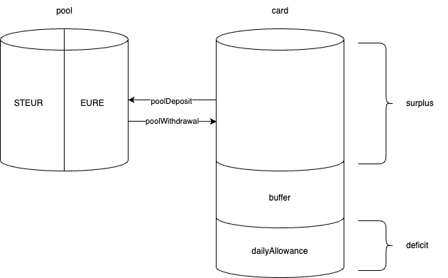

# RoboSaver

RoboSaver turns your [Gnosis Pay card](https://gnosispay.com/) into an automated savings account!

Unused [EURe](https://monerium.com/tokens/) on your card gets deposited into a liquidity pool, where it collects yield and swapping fees. As soon as your card's balance gets below a certain threshold, the RoboSaver will withdraw some EURe from the pool for you and top up your card. Thus creating the perfect balance between having EURe ready for spending and putting EURe to work!

## 1. Technical Details

Only a single smart contract is needed; `RoboSaverVirtualModule`. The module is "virtual", since it doesn't get installed on the Gnosis Pay Safe directly, but on the `Delay` module instead. This way all of its transactions still respect the necessary delay needed to eventually settle with Visa.

Currently the contract is automated by having a keeper call `checker` to see if any action is needed, and, if needed, then call `adjustPool` to perform that necessary action.

### 1.1 External Methods

- `checker()`: a view function that determines whether the balance of the card is in surplus or deficit; returns whether an adjustment to the pool is needed and the payload needed to do so
- `adjustPool(PoolAction _action, uint256 _amount)`: call the necessary internal method needed to rebalance the pool

## 2. Installation

### 2.1 Build

After cloning the repo, run `forge build` to initiate a compilation and fetch necessary dependencies.

Compilation of the contract at the end will raise some errors; this is because currently the `delay-module` requires a separate installation of dependencies. To fix this, run `yarn install --cwd lib/delay-module` (or `yarn install` with your current working directory being `lib/delay-module`).

Finally, copy `.env.example` to `.env` and populate it.

### 2.2 Test

Run `forge test -vvvv`.

## 3. Proof of Concept

This project was conceived at an ETHGlobal hackathon; see details here: https://github.com/onchainification/robosaver/releases/tag/v0.0.1-hackathon
